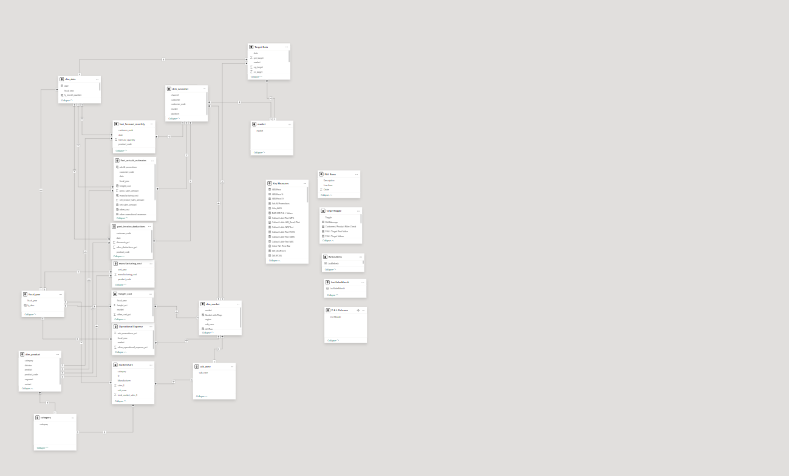
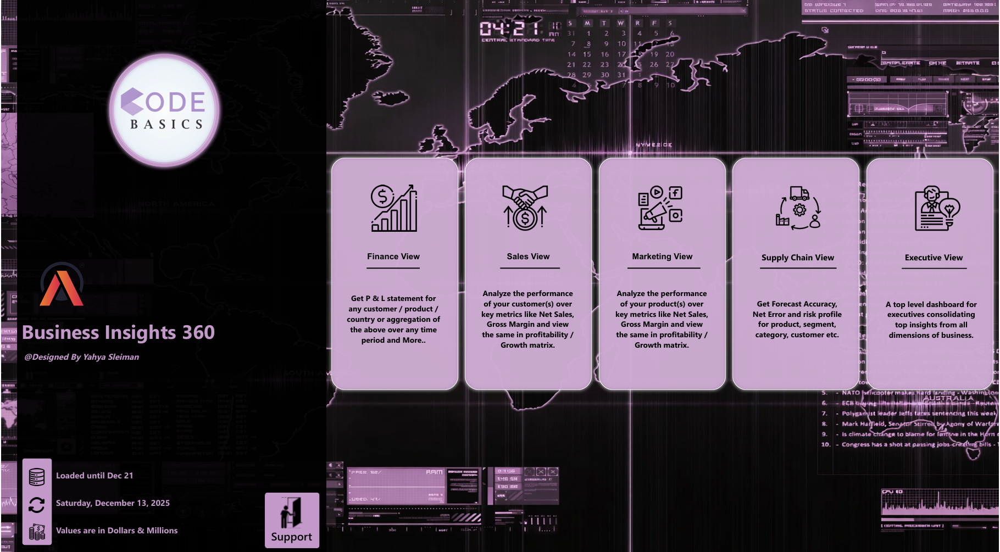
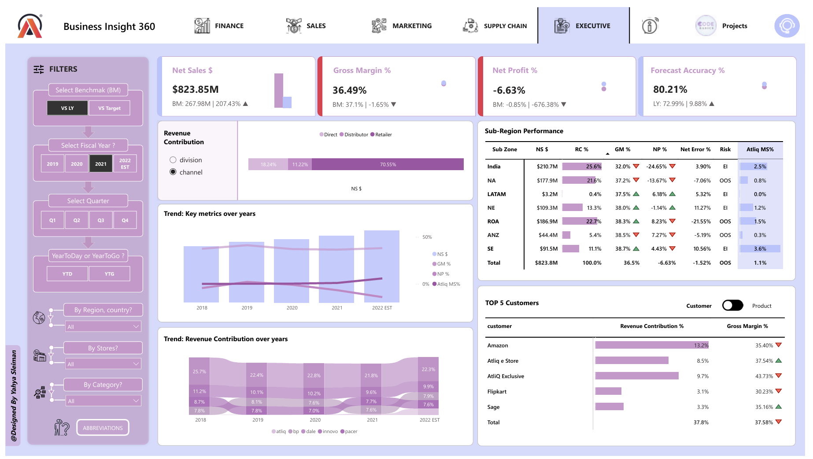
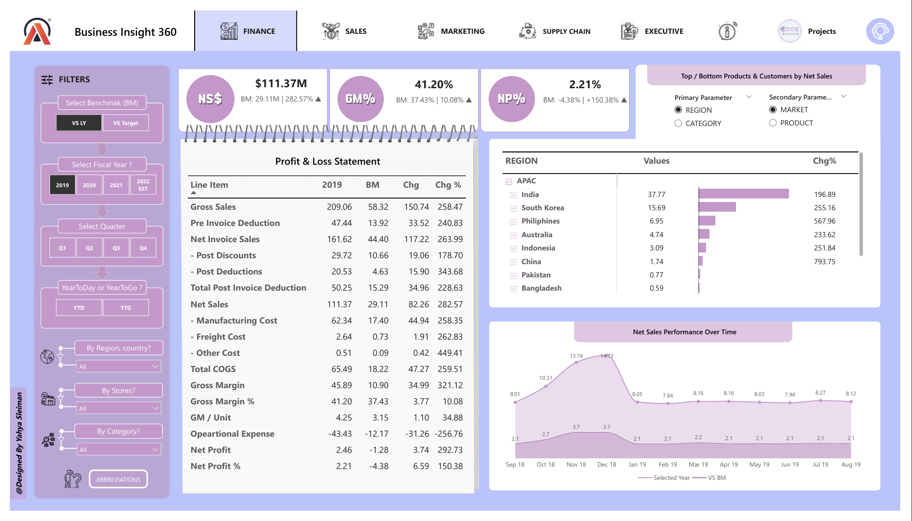
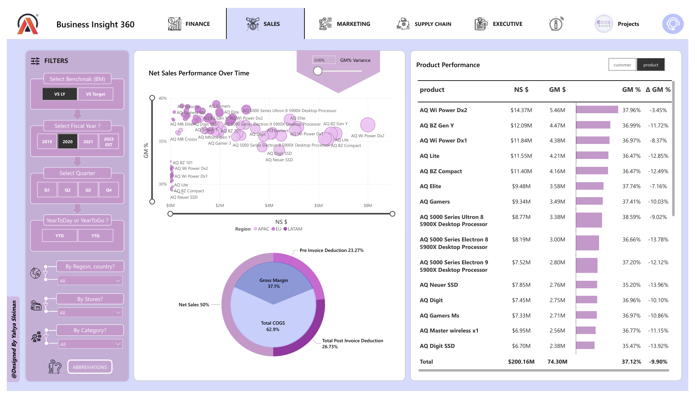
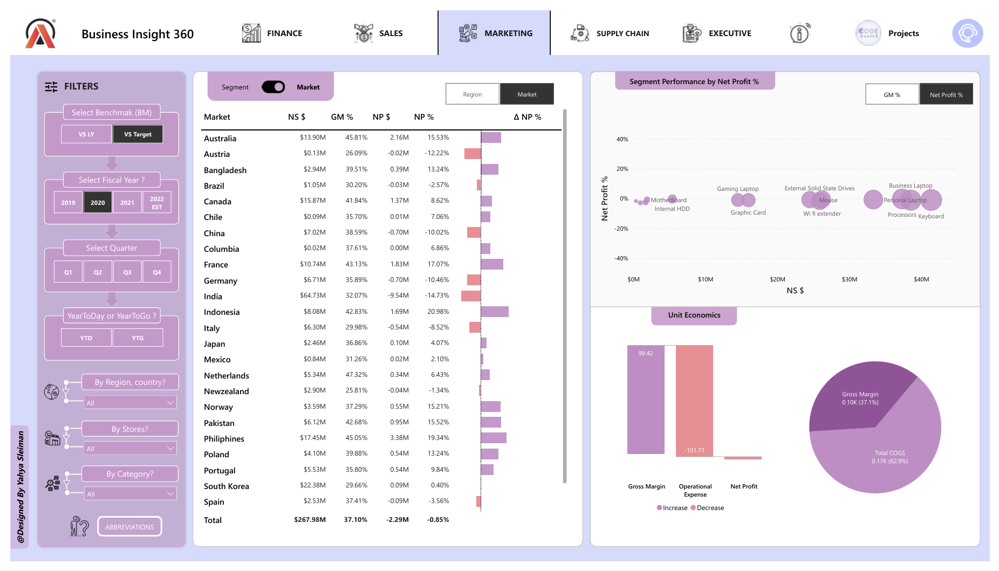
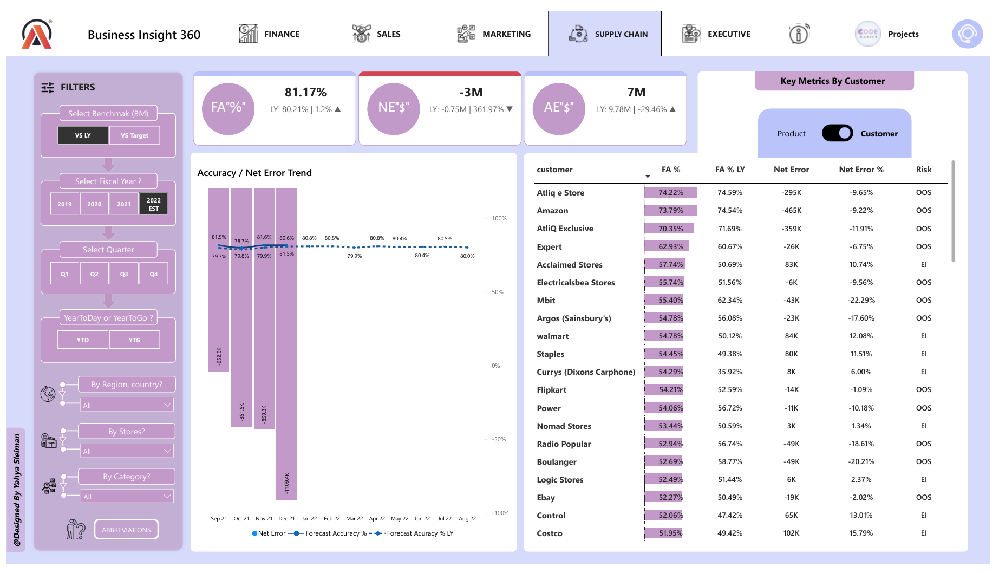

# Business Insights 360 | Power BI End-to-End Analytics Project

An enterprise-level Power BI analytics solution designed to transform raw business data into strategic insights across Finance, Sales, Marketing, Supply Chain, and Executive operations.

---

# 🔗 Live Dashboard
[Click to view live dashboard](https://app.powerbi.com/view?r=eyJrIjoiYjRlYzdiNDMtZTM1Ny00ZGU3LWEwZjEtMjZlNDI3MWRjZmM3IiwidCI6ImM2ZTU0OWIzLTVmNDUtNDAzMi1hYWU5LWQ0MjQ0ZGM1YjJjNCJ9&pageName=12b8d28d202d035ab977)

---

# 📌 Project Overview

Business Insights 360 is a multi-functional analytics platform developed to help stakeholders monitor business performance, profitability, customer behavior, operational efficiency, and forecasting accuracy.

The dashboard enables executives and departments to:

- Monitor KPIs in real time
- Analyze profitability trends
- Identify underperforming markets and products
- Improve forecast planning
- Support data-driven business decisions

---

# 🛠️ Tech Stack

- Power BI
- Power Query
- DAX
- SQL
- Excel
- Data Modeling
- Business Intelligence
- Dashboard Storytelling

---

# 🧩 Data Model

The project uses a structured star-schema model optimized for performance and scalable analytics.

## Key Features

- Fact & dimension modeling
- Optimized relationships
- KPI measure tables
- Parameter tables
- Dynamic filtering architecture

---

# 🏠 Home View

Central navigation hub connecting all business functions.

## Includes

- Finance View
- Sales View
- Marketing View
- Supply Chain View
- Executive View

---

# 👔 Executive View

High-level business overview for leadership and decision-makers.

## Key KPIs

- Net Sales
- Gross Margin %
- Net Profit %
- Forecast Accuracy %

## Key Insights

- Net Sales reached **$823.85M**
- Gross Margin maintained healthy profitability at **36.49%**
- Forecast Accuracy achieved **80.21%**
- Net Profit remained negative, highlighting operational challenges

## Recommendations

- Improve operational cost management
- Focus on high-margin regions and customers
- Enhance forecasting strategies for inventory planning
- Prioritize profitable product segments

---

# 💰 Finance View

Detailed Profit & Loss analytics with benchmarking and trend analysis.

## Analysis Includes

- Gross Sales
- Net Sales
- Gross Margin
- Operational Expenses
- Net Profit
- P&L Trend Analysis

## Key Insights

- Strong Gross Margin performance across years
- Significant operational expenses impacted final profitability
- Net Profit improved compared to benchmark values
- Sales growth remained consistent over time

## Recommendations

- Reduce operational expenses
- Optimize freight and manufacturing costs
- Increase focus on profitable regions and categories
- Improve cost efficiency strategies

---

# 📈 Sales View

Product-level and regional sales performance analytics.

## Analysis Includes

- Product profitability
- Gross Margin variance
- Net Sales performance
- Regional contribution
- Product ranking

## Key Insights

- Certain products generated high sales but declining margins
- APAC region showed strong revenue contribution
- Margin variance highlighted pricing and cost challenges
- Product performance varied significantly across regions

## Recommendations

- Focus on high-profit products instead of only high-sales products
- Reevaluate pricing strategy for low-margin products
- Improve sales mix optimization
- Strengthen performance in underperforming regions

---

# 📣 Marketing View

Market and segment profitability analysis.

## Analysis Includes

- Net Profit %
- Gross Margin %
- Market performance
- Segment profitability
- Unit economics

## Key Insights

- Some markets generated high revenue with low profitability
- Product profitability varied across customer segments
- Operational expenses negatively impacted net profit
- Premium products showed stronger profitability performance

## Recommendations

- Increase investment in profitable product categories
- Reduce marketing spend on low-performing segments
- Improve customer targeting strategies
- Optimize campaign ROI tracking

---

# 🚚 Supply Chain View

Forecasting and operational risk monitoring dashboard.

## Analysis Includes

- Forecast Accuracy %
- Net Error
- Risk analysis
- Customer-level forecasting
- Supply chain efficiency

## Key Insights

- Forecast Accuracy exceeded **80%**
- Several customers showed high forecast error risk
- Negative Net Error impacted inventory planning
- Operational forecasting stability improved over time

## Recommendations

- Improve demand forecasting models
- Focus on customers with high forecast risk
- Strengthen inventory optimization
- Enhance supply chain planning processes

---

# 📊 Key Business Outcomes

- Built a complete enterprise BI solution across multiple departments
- Developed dynamic KPI reporting with advanced DAX
- Improved visibility into profitability and forecasting performance
- Enabled executive-level strategic decision making
- Applied advanced data modeling and dashboard storytelling principles

---

# 🚀 Skills Demonstrated

- Advanced Power BI Development
- DAX Measures & Calculations
- Data Modeling
- KPI Design
- Dashboard UX/UI
- Business Analysis
- Executive Reporting
- Analytical Storytelling
- Performance Optimization

---

# 🔒 Dataset Disclaimer

The original dataset used in this project is not included in this repository due to Codebasics project guidelines and data-sharing restrictions.

This repository is intended to showcase:
- Dashboard design
- Data modeling
- DAX calculations
- Business analysis
- Visualization and storytelling skills

Only screenshots, documentation, and project explanations are shared publicly.

---

# 👨‍💻 Author

## Yahya Sleiman

Data Analyst | Power BI Developer | Business Intelligence Enthusiast

- LinkedIn: www.linkedin.com/in/yahya-sleiman-6b742a356
- Portfolio: https://yahya-datafolio.netlify.app/

Focused on building stakeholder-ready analytics solutions, interactive dashboards, and business-driven insights using Power BI, SQL, DAX, and modern BI practices.

---
